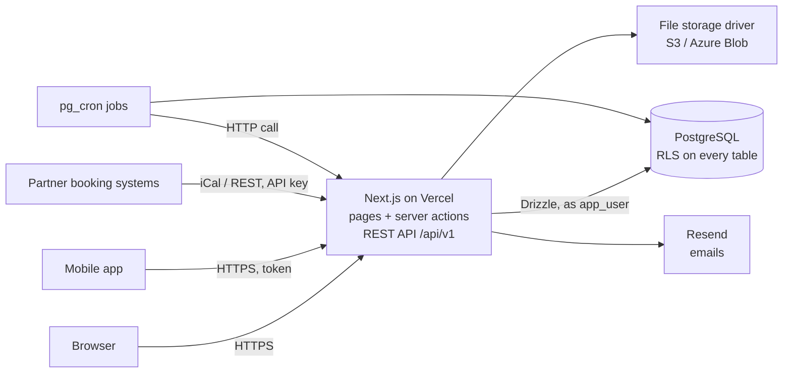

# Implementation Plan — Phase 1 (MVP)

> **Status:** v0.3 · 2026-09-26 · Owner: Zlati. v0.2: portable stack (no provider lock-in), see [deployment.md](deployment.md). v0.3: flight log in M6 (§4.8).
> **Builds:** Phase 1 of [`business-requirements.md`](business-requirements.md): accounts, pilot verification, aircraft listings, search, booking requests with a flight log, ratings, messaging, admin.
> **Tracking:** Every task below is a GitHub issue, grouped into milestones **M0–M10**. Create them with `node scripts/create-github-issues.mjs`.

---

## 1. Summary

We build a **Next.js** web app on **standard PostgreSQL**, with our own login (**Better Auth**) and swappable file storage, packaged as a **Docker** image. Today it runs on **Vercel** with **Supabase** as the Postgres and file host; it can move to **Google Cloud or Azure** by changing configuration ([deployment.md](deployment.md)). Work goes milestone by milestone, and each milestone ends with something you can click through. The order follows the dependencies: you need accounts before pilots, pilots and aircraft before search, search before booking, and bookings before ratings.

```
M0 Foundations → M1 Accounts → M2 Airports → M3 Pilot verification → M4 Aircraft listings
   → M5 Search & availability → M6 Booking & flight log → M7 Ratings → M8 Messaging → M9 Admin → M10 Launch
```

**First "wow" moment:** end of **M5**, when a pilot can search and find a real listed aircraft with its calendar.
**First usable product:** end of **M7**, when the full rent → fly → rate loop works.

## 2. Tech stack

| Layer | Choice | Why |
|-------|--------|-----|
| Framework | **Next.js 16** (App Router, Server Components, Server Actions) + **TypeScript** strict | Already set up. One codebase for UI and server logic |
| UI | **Tailwind CSS v4** + **shadcn/ui** components | Fast to build, looks professional, and Claude knows it very well. Components live in our repo, so we own them |
| Forms & validation | **Zod** + **react-hook-form** | One schema validates both the browser form and the server action |
| Database | **PostgreSQL 14+** via **Drizzle ORM** (`postgres` driver). Hosted on Supabase (Frankfurt) today | Real SQL, portable to Cloud SQL / Azure PostgreSQL. Only extension: `btree_gist` (no double bookings); radius search is plain SQL and scheduled jobs call `/api/cron/daily` |
| Auth | **Better Auth** (open source), users stored in our own Postgres tables | Email + password, Google, Apple, Facebook, email verification, password reset, 2FA plugin later. No auth vendor to migrate away from |
| File storage | `lib/storage` with drivers: **S3-compatible** (Supabase Storage today, Google Cloud Storage, AWS, R2), **Azure Blob**, local (dev) | Public bucket for photos; private bucket with signed URLs for licences, medicals and aircraft documents (M3) |
| Security model | **Row Level Security (RLS)** on every table; user queries run as role `app_user` with `app.user_id` set (`lib/db/rls.ts`) | The database itself enforces who can see what, even if app code has a bug. Plain Postgres, works on any host |
| Email | `lib/email`: **SMTP** (Resend, SendGrid, Azure Communication Services…) or console in dev | Transactional emails (verification, password reset, booking requests, reminders) |
| Maps | **MapLibre GL JS** + a hosted tile provider (e.g. MapTiler) | Open source and cheap. Decide the provider in M5 |
| Airport data | **OurAirports** open dataset | ICAO codes, names, coordinates, runways |
| Testing | **Vitest** (unit) + **Playwright** (end-to-end) | Playwright tests the key flows in a real browser |
| Hosting | **Vercel** (`fra1`) today; **Docker** image for Cloud Run / Azure Container Apps | Zero-config previews now; portable later |
| CI | **GitHub Actions** | typecheck + lint + tests + build on every push |
| Monitoring (M10) | **Sentry** (errors) + **Plausible** or similar (privacy-friendly analytics) | Know when something breaks, without cookie banners for analytics |

## 3. Architecture



- **Server-first:** pages are Server Components that read data with the user's session. Changes go through **Server Actions** that validate with Zod.
- **Business rules live in the database**, when they must never be broken: no double bookings, eligibility checks and review publishing are enforced in Postgres (constraints, functions, RLS). The UI calls the same functions, so the rules exist in one place only.
- **Owner connection** (`getDb()`, bypasses RLS) is used only by Better Auth and trusted admin/cron code. Everything user-facing goes through `asUser()` / `asAnon()`.
- **One backend, several clients (API-1, 2026-10-08):** business operations live in `lib/` as plain
  functions `(userId, input) → result | error` (the backend core). Server Actions (website forms) and
  the REST API (`app/api/v1`, mobile app and partners) are thin adapters around the same functions,
  so validation, permissions and database rules are identical. The website keeps rendering pages on
  the server (fast, no extra hop); the API accepts only Bearer tokens (Better Auth `bearer` plugin),
  never cookies. The API could later be deployed separately (API-8) because it only depends on `lib/`.

## 4. Key technical decisions

### 4.1 No double bookings (SRC-5, BKG-5)
All time an aircraft is busy lives in one table, `calendar_entries` (`aircraft_id`, `period tstzrange`, `kind` = booking / owner_use / maintenance / unavailable). A Postgres **exclusion constraint** makes overlapping active entries impossible, even if two pilots click "Book" at the same moment:

```sql
exclude using gist (aircraft_id with =, period with &&) where (active)
```

A booking request creates an active entry (the hold). If the request is declined, expires or is cancelled, the entry is deactivated.

### 4.2 One eligibility check (VER-6, RAT-6/7/8, BKG-1)
A Postgres function `check_eligibility(pilot_id, aircraft_id, period)` returns the list of **failed requirements**, each with a human-readable reason like "Requires ≥ 50 h on type, you have 12 h". It is used:
- in search, for the "I meet the requirements" filter
- on the aircraft page, to show what's missing
- inside the booking function, so it can't be bypassed

### 4.3 Double-blind reviews (RAT-3)
Reviews are stored with `submitted_at` and `published_at`. RLS shows a review only to its author until `published_at` is set. A trigger publishes both reviews when the second one arrives, and a `pg_cron` job publishes after 14 days. Rating averages on profiles and aircraft update by trigger on publish.

### 4.4 Documents & medical privacy (VER-3, §7 GDPR)
- One private bucket `documents` (keys per user). Files are never linked directly: the app serves them at `/api/documents/<id>` after checking owner/admin (decided in M3 instead of signed URLs, so access checks and logging work the same on every storage provider).
- Owners never get the medical file, only the `valid_until` date and a verified flag.
- Admin access to documents is logged in `admin_actions`.

### 4.5 Time (§7)
All timestamps are `timestamptz`, stored in UTC. Each airport has an IANA timezone (worked out from its coordinates at import). The UI shows airport-local time with UTC next to it on booking screens.

### 4.6 Scheduled jobs
The platform scheduler (Vercel Cron today; Cloud Scheduler / Azure Container Apps jobs later) calls an API route protected by `CRON_SECRET` (M3 added `/api/cron/daily`):

| Job | Frequency | What |
|-----|-----------|------|
| Expire booking requests | every 15 min | Requests past `expires_at` (24 h) → expired, calendar hold released |
| Publish reviews | hourly | Publish reviews older than 14 days |
| Document expiry | daily | Mark expired credentials/aircraft documents, auto-unlist aircraft, queue 30-day reminders |
| Booking reminders | hourly | Queue "your flight is tomorrow" notifications |

Notifications are written to a `notifications` table (in-app). A server route sends the matching emails through the SMTP driver; a scheduled job calls that route.

### 4.7 Search (SRC-1/2)
Aircraft home bases are airports with latitude/longitude. The search (`lib/aircraft/search.ts`) takes an airfield + radius + period + filters and returns listed aircraft within the radius (great-circle distance in plain SQL, after a bounding-box filter) that have **no overlapping active calendar entry** in that period (`aircraft_is_free()`), and optionally only those the pilot may rent (`i_meet_requirements()`). Filters and sorting are plain SQL; no PostGIS or search engine at MVP scale.

### 4.8 Flight log and the amount due (BKG-7, BKG-12…16)
- One `flight_logs` row per booking, with one or more `flight_legs`. Status: `draft` → `submitted` → `confirmed` (or `correction_requested` → back to the pilot). Only the pilot edits a draft; only the owner confirms. Confirming completes the booking.
- **Flown time** follows the aircraft's `time_basis`: Hobbs = Σ(hobbs_end − hobbs_start), tach = Σ(tach_end − tach_start), block = Σ(block_on − block_off). **Amount due** = flown time × rate (± minimum hours per day), then fuel: on a wet rate, fuel the pilot paid for is subtracted; on a dry rate, fuel the owner supplied is added. One tested function in `lib/domain` does this, shown to both sides before confirming.
- **Units:** stored in SI and UTC (litres, minutes, `timestamptz`); meters as `numeric` with one or two decimals. Fuel is shown in the user's units (litres / US gal). Oil is shown in the aircraft's dipstick unit (`aircraft.oil_unit`: US quarts or litres).
- **Sanity checks** in the database: engine start ≤ block off < take-off < landing < block on ≤ engine stop (max 12 h per leg), end meters > start meters, within a leg fuel after < fuel before and oil after ≤ oil before, fuel/oil ≥ 0, landings ≥ 1 per leg (migration 0051). Fuel or oil that rises between legs by more than the uplifts recorded at that airfield is a warning in the UI, not an error.
- Receipt photos use the private `documents` storage from M3; the log's photos (meters, fuel gauges) too.
- Every change after submission is written to `booking_events`, so owner and pilot can see who changed what.
- The log is labelled as not replacing the aircraft's journey/tech log or the pilot's logbook.

### 4.9 API conventions (API-1…5)
- Versioned paths (`/api/v1/...`); breaking changes only in a new version.
- JSON in and out. Errors: `{ "error": { "code": "not_found", "message": "…" } }` with the HTTP
  status (400 validation with field errors, 401 no/invalid token, 403, 404, 409 conflict, 429, 500).
- Lists: `?limit=` (max 100) and an opaque `cursor`; response `{ "data": [...], "nextCursor": … }`.
- Times ISO 8601 in UTC; quantities in SI units as stored (litres, kg, minutes); money as numbers
  with an ISO currency code.
- Request bodies validated with the same Zod schemas as the website; OpenAPI generated from them
  (`z.toJSONSchema`) at `/api/v1/openapi.json`.

### 4.10 Calendar sync (SYN-1…7)
- External busy times are rows in `calendar_entries` (new kind `external`, with the source and its
  event id), so the **same exclusion constraint** keeps them from overlapping ownAplane bookings.
- iCal import: the owner's ICS links are fetched by a sync job (target every 15 min) and again,
  with a short timeout, right before a booking request is created or accepted (SYN-2). Events are
  upserted by UID; removed events are deactivated. Recurring events are expanded for the next 12
  months.
- An imported event that overlaps an active ownAplane booking can't be stored as active: it is kept
  as a **conflict** and the owner is notified (SYN-5).
- iCal export: a secret, resettable link per aircraft (`/api/v1/calendars/<token>.ics`) with busy
  times only (SYN-3).
- Push API for partners (SYN-4): `PUT/DELETE /api/v1/aircraft/{id}/external-busy/{externalId}` with
  a per-aircraft API key (stored hashed); 409 on overlap.

## 5. Data model (Phase 1)

| Table | Key columns | Notes |
|-------|-------------|-------|
| `profiles` | `id` (= user), display_name, avatar_key, home_airport_ident → airports, rating_avg, rating_count, suspended_at | Created by trigger on sign-up. Locale/units live in `user_settings` |
| `user_roles` | user_id, role (`pilot`/`owner`/`admin`) | One user, many roles |
| `airports` | ident (PK: ICAO or local id), type, name, icao_code, iata_code, municipality, country, latitude, longitude, elevation_ft, timezone | Imported from OurAirports (EU airfields) with `npm run airports:import`. Plain lat/lon; PostGIS decision in M5 |
| `pilot_licences` | user_id, type (LAPL/PPL/CPL/ATPL/MPL/other), issuing_state, number, issued_on, expires_on, document_id, status, rejection_reason, reviewed_by/at, reminder_sent_at | Built in M3 |
| `pilot_ratings` | user_id, kind (class/type/privilege), code (SEP_LAND, NIGHT, IR, C510…), expires_on, document_id, status + review columns | Built in M3 |
| `medicals` | user_id, class, issuing_state, valid_until, document_id, status + review columns | Owner + admins only (RLS). Built in M3 |
| `pilot_experience` | user_id, total_hours, pic_hours, last_90_days_hours, updated_at | Self-declared in MVP. Built in M3 |
| `experience_by_type` | user_id, aircraft_type, hours | Built in M3 |
| `documents` | id, owner_id, storage_key, filename, content_type, size_bytes | Private files (M3). Review status lives on the credential / aircraft document that uses it |
| `aircraft` | id, owner_id, registration, manufacturer, model, year, category, seats, engine, fuel_type, fuel_burn, cruise_kt, useful_load_kg, endurance_h, equipment (jsonb), vfr/night/ifr flags, home_airport_id, price_per_hour, price_basis (wet/dry), time_basis (hobbs/tach/block), oil_unit (qt/l), currency, min_hours_per_day, cancellation_policy, status (`draft`/`listed`/`paused`/`unlisted`/`grounded`), rating_avg, rating_count | |
| `aircraft_photos` | aircraft_id, path, sort_order | Public bucket |
| `aircraft_documents` | aircraft_id, kind (CofA/ARC/insurance/POH/checklist/W&B), document_id, expires_on | |
| `rental_requirements` | aircraft_id (1:1), min_pilot_rating, allow_unrated, unrated_needs_checkout, licence_types[], required_ratings[], min_total_h, min_type_h, min_90d_h, min_age | |
| `calendar_entries` | id, aircraft_id, period (`tstzrange`), kind, booking_id, note, active | Exclusion constraint (§4.1) |
| `bookings` | id, aircraft_id, pilot_id, status (`requested`/`accepted`/`declined`/`expired`/`cancelled`/`in_progress`/`completed`), purpose, destinations, passengers, estimate, expires_at, cancelled_by, cancel_reason | |
| `booking_events` | booking_id, actor_id, type, payload, created_at | History / audit |
| `flight_logs` | booking_id (1:1), status (`draft`/`submitted`/`correction_requested`/`confirmed`), check-out photos, flown_minutes, amount_due, fuel_adjustment, currency, submitted_at, confirmed_by_owner_at, correction_note | Final time and amount due (§4.8) |
| `flight_legs` | flight_log_id, seq, from_ident / to_ident → airports, block_off, engine_start, takeoff_at?, landing_at?, engine_stop, block_on, landings, hobbs_start/end, tach_start/end, fuel_before_l, fuel_after_l, oil_before_l, oil_after_l | UTC; sanity checks (§4.8) |
| `uplifts` | flight_leg_id, kind (`fuel`/`oil`), quantity_l, fuel_type or oil_grade, airport_ident, price, currency, paid_by (`pilot`/`owner`), receipt_document_id | Refuelling and oil added |
| `aircraft_remarks` | aircraft_id, booking_id, flight_leg_id, author_id, topic (`aircraft`/`weather`/`airfield`), text, known_item, resolved_at | Remarks / PIREPs; known items shown to renters |
| `defects` | aircraft_id, booking_id, flight_leg_id, reported_by, description, photos, severity, grounded, resolved_at | |
| `reviews` | booking_id, author_id, subject_user_id, subject_aircraft_id, direction (pilot→owner / owner→pilot), scores (jsonb), overall, comment, submitted_at, published_at, hidden_at, owner_reply | |
| `conversations` / `messages` | conversation: booking_id or aircraft_id, participants. Message: sender, body, read_at | |
| `notifications` | user_id, type, payload, read_at, emailed_at | |
| `reports` | reporter_id, target_type, target_id, reason, status | |
| `admin_actions` | admin_id, action, target, reason, created_at | Audit log |

## 6. Project structure (target)

```
app/
  (marketing)/            # landing page, about, legal pages
  (auth)/                 # login, signup, verify, reset password
  (app)/                  # logged-in area
    search/               # aircraft search
    aircraft/[id]/        # aircraft detail + booking request
    bookings/             # my bookings (as pilot)
    owner/aircraft/       # my aircraft, calendar, requests (as owner)
    profile/              # my profile, credentials, settings
    messages/
    u/[id]/               # public profile
  admin/                  # admin area (admin role only)
  api/                    # cron and webhook routes only
components/
  ui/                     # shadcn/ui components
  ...                     # feature components (AircraftCard, AirportPicker…)
lib/
  auth/                   # Better Auth config, session helpers
  db/                     # Drizzle schema, connection, asUser()/asAnon() for RLS
  storage/                # file storage drivers (s3, azure, local)
  email/                  # email drivers (smtp, console) + templates
  validation/             # Zod schemas
  domain/                 # pure logic: pricing, time/UTC helpers, formatting
db/
  migrations/             # SQL migrations (drizzle-kit), the only way the schema changes
scripts/                  # one-off scripts (airport import, GitHub issues)
tests/e2e/                # Playwright tests
docs/                     # requirements, plan
```

## 7. Environments & one-time setup

| Environment | Database + files | App | Used for |
|-------------|------------------|--------|----------|
| **dev** | `ownaplane-dev` (Frankfurt) | Preview deployments | Daily work, test data |
| **prod** | `ownaplane-prod` (Frankfurt), created in M10 | Production | Real users |

**Setup (done):** Supabase project in Frankfurt (Postgres + Storage bucket `media`), Vercel project, `.env.local` from `.env.example`. Moving to Google Cloud or Azure: [deployment.md](deployment.md).

## 8. Milestones

Sizes: **S** ≈ a few hours · **M** ≈ 1–2 sessions · **L** ≈ 3+ sessions. The timeline is a rough guess at ~10 h/week with Claude, to refine after M1.

| # | Milestone | Requirements | Demo at the end | Rough time |
|---|-----------|--------------|-----------------|------------|
| M0 | Foundations | — | App deployed on Vercel with a database, CI green | 1 wk |
| M1 | Accounts & profiles | ACC-1…5 | Sign up, verify email, edit profile, switch roles, public profile | 1–2 wk |
| M2 | Airports | (LST-4, SRC-1 base) | Type "LBSF" → Sofia, with timezone | 0.5 wk |
| M3 | Pilot verification | VER-1…6, ADM-1 | Pilot uploads licence/medical, admin verifies, badges appear | 2 wk |
| M4 | Aircraft listings | LST-1…8, RAT-6/7 | Owner lists an aircraft with photos, price, requirements; admin verifies docs | 2 wk |
| M5 | Search & availability | SRC-1…5, RAT-8 | Pilot searches by airport + dates, sees map/list, opens aircraft, sees calendar and eligibility | 2–3 wk |
| M6 | Booking & flight log | BKG-1…10, 12…16, MSG-3 | Request → accept → check-out → flight log (legs, block/engine times, fuel, oil, refuels, remarks) → owner confirms → completed, with emails | 3–4 wk |
| M7 | Ratings | RAT-1…5 | Both sides rate, double-blind reveal, ratings on profiles | 1 wk |
| M8 | Messaging | MSG-1, MSG-2 | Pilot and owner chat about a booking; contacts revealed on accept | 1 wk |
| M9 | Admin & trust | ADM-2…4 | Admin suspends, hides, handles reports; audit log | 1 wk |
| M10 | Launch readiness | §7, §9 of requirements | Production live, legal pages, monitoring, private beta | 2 wk |

**Total:** roughly 4–5 months part-time. Each milestone's issues are on GitHub.

**After launch readiness (decided 2026-10-08):**

| # | Milestone | Requirements | Demo at the end | Rough time |
|---|-----------|--------------|-----------------|------------|
| M11 | API foundation | API-1, 2, 4, 5 | An app signs in with a token and reads its profile, airports, aircraft search and bookings through `/api/v1`; OpenAPI published | 1–2 wk |
| M12 | Calendar sync | SYN-1…5 | An aircraft linked to a Google Calendar can't be booked over its events; the other system subscribes to ownAplane's iCal link; a partner pushes a booking, gets 409 on overlap | 2 wk |
| M13 | Full API | API-3, 6, 7, SYN-6 | Everything on the website is possible through the API (booking flow, flight log, messages); push notifications | 3–4 wk |

## 9. How we build each task (with Claude)

1. Pick the next open issue in the current milestone, e.g. **"Implement issue #12"**, and paste the issue or give Claude its number.
2. Claude reads `CLAUDE.md`, this plan and the requirement IDs in the issue, then proposes a short approach for anything non-trivial **before** coding.
3. Schema changes are **always a migration**: edit `lib/db/schema/`, run `npm run db:generate`, and put RLS policies/grants/functions in a custom SQL migration (`npm run db:custom -- <name>`).
4. **Definition of done** for every issue:
   - [ ] Acceptance criteria in the issue are met
   - [ ] RLS policies added/updated for any new table, with a test that another user **can't** read or write it
   - [ ] `npm run typecheck`, `npm run lint`, `npm test` and `npm run build` pass
   - [ ] Works on a phone-sized screen
   - [ ] Docs updated if something changed (`CLAUDE.md` structure, decisions log)
5. Commit with the issue number, e.g. `Add sign-up flow (#9)`, which links the commit to the issue.

## 10. Testing strategy

| Level | Tool | What |
|-------|------|------|
| Unit | Vitest | Pure logic in `lib/domain` (price estimate, flown time and amount due, unit conversion, time/UTC, eligibility formatting) |
| Database | Vitest against a real Postgres (`tests/db/`, `TEST_DATABASE_URL`) | Exclusion constraint, `check_eligibility`, RLS "other user can't see" cases, review publishing |
| End-to-end | Playwright | Golden paths: sign up → list aircraft → search → book → flight log → owner confirms → review |

## 11. Risks & how we handle them

| Risk | Mitigation |
|------|------------|
| **Chicken-and-egg:** no aircraft means no pilots | Onboard 10–20 owners personally before public launch (clubs, airfields you know). Seed data for demos |
| **RLS mistakes leak private data** | RLS tests in the definition of done, plus a security review issue in M10 |
| **Legal uncertainty** (operator status, insurance) | Lawyer review before M10 (see requirements §9). Clear terms: the platform is a marketplace |
| **Scope creep** | New ideas go to the parking lot in the requirements, not into the current milestone |
| **Beginner Git/infra friction** | Small steps, Claude explains commands, CI catches mistakes |

## 12. Costs (rough)

Development can run on **free tiers** (Supabase, Vercel Hobby, an SMTP provider, map tiles). At launch expect paid plans for Supabase (backups, no pausing), Vercel (the Hobby plan is for non-commercial use) and a domain, roughly tens of euros per month in total at small scale. Check current pricing when we get to M10.

## 13. After Phase 1 (outline)

- **Phase 2 — Maintenance:** `technician_profiles`, `organisations`, `service_offerings`, `quote_requests`, `maintenance_jobs`. Maintenance jobs create `calendar_entries` of kind `maintenance`. Hours from `check_records` drive "check due" reminders.
- **Phase 3 — Airports:** `airport_operators` (claim + verify), `airport_services`, `airport_requests` (PPR/parking/hangar/services/customs).
- **Phase 4 — Payments:** Stripe Connect, deposits, payouts, commission.
